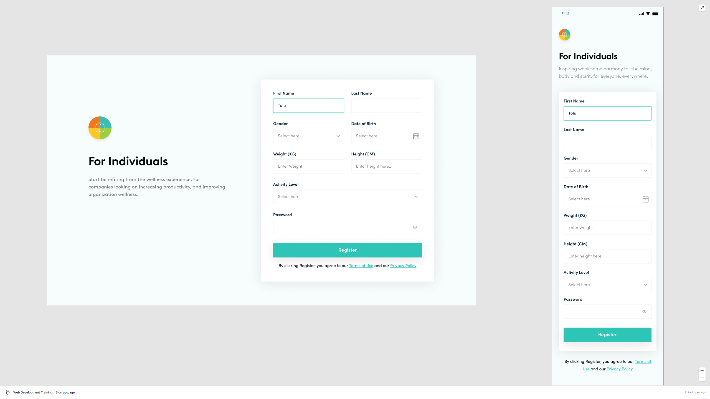

# CSS Assignments

This folder contains solutions for CSS conversion assignments. Each assignment focuses on converting design mockups into pixel-perfect implementations using **plain HTML and CSS only**.

## Assignments Overview

You can view the live version of all the assignments here:  
[Assignments Live Link](https://1732-altschool-css-assignments.netlify.app/)

## Assignment 1: Card Component

### Description

Convert the "Otter Essay" card design into HTML and CSS implementation. The design features a card component with:

- Pink header section
- Body text content
- Proper spacing and typography
- Card shadow and rounded corners

### Requirements

- Plain HTML and CSS only
- Pixel-perfect conversion from design
- Responsive behavior

## Live Link

You can view the live version of this assignment here:  
[Assignment 1 Live Link](https://1732-altschool-css-assignments.netlify.app/assignment-1/)


---

## Assignment 2: Agency Landing Section

### Description

Implement the "Huckleberry" agency section design. Features include:

- Main heading with highlighted text
- Gray divider sections
- Yellow highlight section
- Proper typography and spacing
- Card shadow effects

### Requirements

- Clean, semantic HTML structure
- CSS-only implementation
- Accurate color matching
- Proper text styles and spacing

## Live Link

You can view the live version of this assignment here:  
[Assignment 2 Live Link](https://1732-altschool-css-assignments.netlify.app/assignment-2/)


---

## Assignment 3: Product Card

### Description

Convert the "Novus Watch" product card design. Elements include:

- "New and Improved!" label
- Product image
- Title and description text
- Card styling with shadow effects
- Light background

### Requirements

- Semantic HTML structure
- CSS styling matching the design
- Proper spacing and typography
- Shadow and rounded corner effects

## Live Link

You can view the live version of this assignment here:  
[Assignment 3 Live Link](https://1732-altschool-css-assignments.netlify.app/assignment-3/)


---

### Assignment 4: Registration Form

### Description

Implement the responsive registration form design. Components include:

- Logo and heading section
- Form fields (First Name, Last Name, Gender, Date of Birth, etc.)
- Register button
- Terms and Privacy Policy links
- Responsive layout for desktop and mobile

### Requirements

- Semantic form structure
- Responsive design implementation
- Proper form field styling
- Accurate typography and spacing
- Mobile-first approach

## Live Link

You can view the live version of this assignment here:  
[Assignment 4 Live Link](https://1732-altschool-css-assignments.netlify.app/assignment-4/)



Here's the README snippet for **Assignment 5** based on the provided structure and details:

---

### Assignment 5: Checkout Page

### Description

Convert the provided Figma design into a pixel-perfect **Checkout Page** using **HTML** and **CSS**. Components include:

- Header section with logo and navigation links.
- Main checkout section with:
  - **Basic Information Form** (First Name, Last Name, Email).
  - **Payment Information Form** (Credit Card Number, Expiry Date, and CVC).
- Sidebar with subscription plan details, pricing, and testimonials.
- Footer section with branding and legal links.

### Requirements

- **Pixel-perfect Design**: Ensure all spacing, typography, and alignment match the Figma design.
- **Responsive Layout**: Optimize the page for different screen sizes.
- **CSS Structure**:
  - Use a CSS reset file for consistent styling across browsers.
  - Modular CSS for layout and components.
- **Semantic HTML**: Use appropriate HTML5 elements for better accessibility and structure.
- **Assets**: Include all necessary assets such as icons, images, and fonts.

## Live Link

You can view the live version of this assignment here:  
[Assignment 5 Live Link](https://1732-altschool-css-assignments.netlify.app/assignment-5/)


---

## Assignment 6: Advanced URL Shortening Landing Page

### Description

This assignment involves building a **landing page** for an advanced URL shortening solution using **HTML**, **SCSS**, and **JavaScript**. The page includes a responsive layout.
The project leverages **SCSS** as a CSS preprocessor and **Gulp** as a build tool to automate tasks like compiling SCSS to CSS and minifying files. Practiced DRY and BEM methodology.

### Key Features:

- **Navbar with Scroll Functionality**: A sticky navbar that allows smooth scrolling to different sections of the page.
- **Sections**: Visually appealing sections with a call-to-action buttons and descriptive text about the URL shortening solution.
- **Responsive Design**: The page is optimized for various screen sizes, ensuring a seamless user experience across devices.
- **SCSS for Styling**: Modular SCSS files are used for better organization and maintainability of styles.
- **Gulp Automation**: Gulp is used to automate tasks like compiling SCSS, minifying CSS, and more.

### Requirements

1. **HTML Structure**:

   - Use semantic HTML5 elements for better accessibility and structure.

2. **SCSS Styling**:

   - Use **SCSS** to write modular and maintainable CSS.
   - Organize SCSS files into `base`, `components`, `sections`, and `root` folders.
   - Compile SCSS into a single `main.css` file using Gulp.

3. **JavaScript Functionality**:

   - Implement smooth scroll functionality for the navbar using JavaScript.
   - Ensure the navbar is fixed and remains visible while scrolling.

4. **Responsive Design**:

   - Optimize the page for different screen sizes (desktop, tablet, mobile).
   - Use media queries to adjust layout and styling.

5. **Gulp Automation**:
   - Set up Gulp to automate tasks like:
   - Compiling SCSS to CSS.
   - Watching for changes in SCSS files.
   <!-- - Minifying CSS and JavaScript files. -->

### Dependencies

The project uses the following npm packages (listed in `package.json`):

- **gulp**: Task runner for automating build processes.
- **gulp-sass**: Compiles SCSS to CSS.
- **sass**: SCSS compiler.
<!-- - **gulp-clean-css**: Minifies CSS files. -->

## Live Link

You can view the live version of this assignment here:  
[Assignment 6 Live Link](https://1732-altschool-css-assignments.netlify.app/assignment-6/)


---

## Folder Structure

```
css/
├── assignment-1/
│   ├── css/
│   │   ├── reset.css
│   │   └── style.css
│   └── index.html
├── assignment-2/
│   ├── css/
│   │   ├── reset.css
│   │   └── style.css
│   └── index.html
├── assignment-3/
│   ├── css/
│   │   ├── reset.css
│   │   └── style.css
│   ├── img/
│   └── index.html
├── assignment-4/
│   ├── assets/
│   ├── css/
│   │   ├── reset.css
│   │   ├── style.css
│   │   ├── form.css
│   │   ├── layout.css
│   │   └── variables.css
│   ├── font/
│   └── index.html
├── assignment-5/
│   ├── assets/
│   ├── css/
│   │   ├── layout.css
│   │   ├── reset.css
│   │   ├── style.css
│   └── index.html
├── assignment-6/
│   ├── assets/
│   │   ├── font/
│   │   ├── imgs/
│   │   ├── svgs/
│   ├── css/
│   │   └── main.css
│   ├── js/
│   │   └── script.js
│   ├── scss/
│   │   ├── base/
│   │   ├── components/
│   │   ├── root/
│   │   ├── sections/
│   │   └── main.scss
│   ├── node_modules/
│   ├── gulpfile.js
│   ├── index.html
│   ├── package-lock.json
│   ├── package.json
│   └── README.md
├── images/
│   ├── assignment-1.png
│   ├── assignment-2.png
│   ├── assignment-3.png
│   └── assignment-4.png
│   └── assignment-5.png
│   └── assignment-6.png
└── README.md
```

## Notes

- All assignments are implemented using **HTML and CSS only** (expect Assignment 6)
- No JavaScript or external libraries are used (expect Assignment 6)
- Each assignment includes a `reset.css` file to normalize browser styles
- Reference images for each assignment are in the `images` folder
- Focus on pixel-perfect conversions while maintaining clean, semantic code
